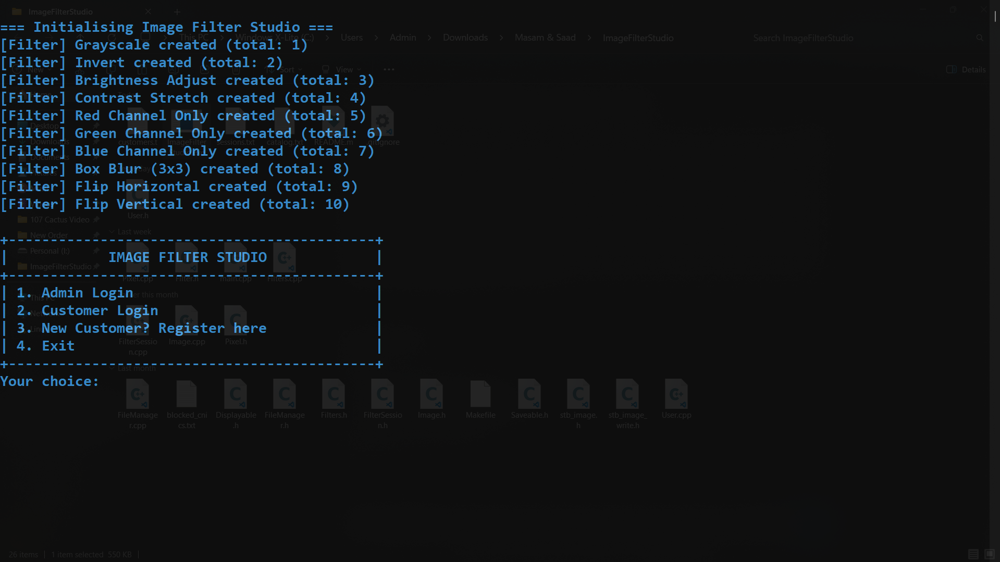
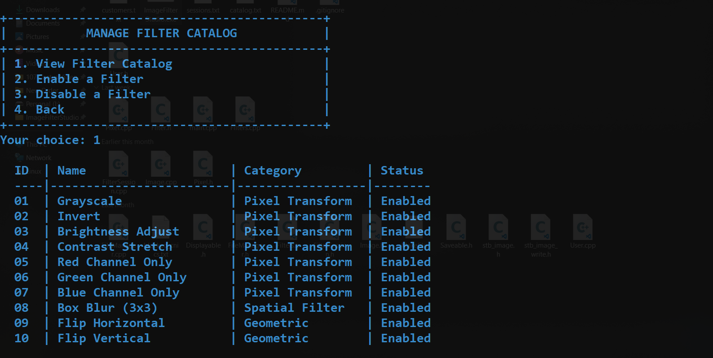

# ImageFilterStudio

A C++ image filtering and image processing desktop application developed using object-oriented programming concepts.

---

# Features

- Multiple image filters
- File management system
- Session handling
- Modular OOP architecture
- Persistent customer/catalog storage

---

# Technologies Used

- C++
- OOP
- Makefile
- File Handling

---

# Project Structure

- `Image.cpp` → image operations
- `Filters.cpp` → filter implementations
- `FileManager.cpp` → file/database management
- `FilterSession.cpp` → session handling

---

# Build Instructions

## Using Makefile

```bash
make
```

OR

```bash
g++ *.cpp -o ImageFilterStudio.exe
```

## Run

```bash
./ImageFilterStudio
```

---

# Screenshots

## Main Interface


## Applying Filters


## Image Processing Output


# Contributors

- Saad Mehmood
